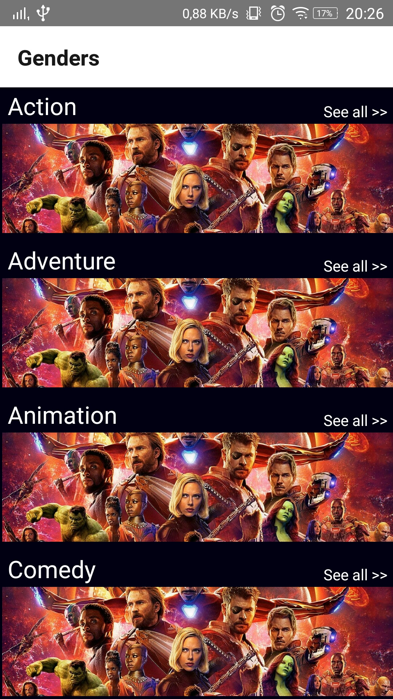
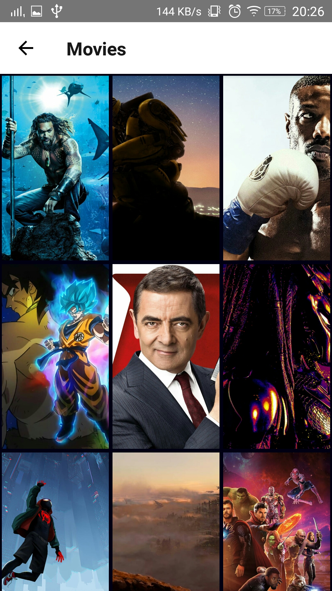

# React Native Movies Review

React Native App with the same style as Netflix for android and iOS. I released a serie of videos on Youtube with a walkthrough explaining every part of this application. Movies source from themoviedb.org

Sreenshots
---------

    

Server
-----
    themoviedb.org and youtube.com

Dependences used
------------
    "react": "16.6.3",

    "react-native": "0.57.8",

    "react-native-fbsdk": "^0.8.0",

    "react-native-gesture-handler": "^1.0.12",

    "react-native-linear-gradient": "^2.5.3",

    "react-native-modalbox": "^1.6.0",

    "react-native-ratings": "^6.1.0",

    "react-native-vector-icons": "^6.1.0",

    "react-native-youtube": "^1.1.0",
    
    "react-navigation": "^3.0.8"

Installation
------------
    $ clone this repo
    $ npm install
    $ react-native upgrade
    $ react-native link
    $ react-native run-android or react-native run-iOS 

A few components must be installed with react-native link check out the following list.
